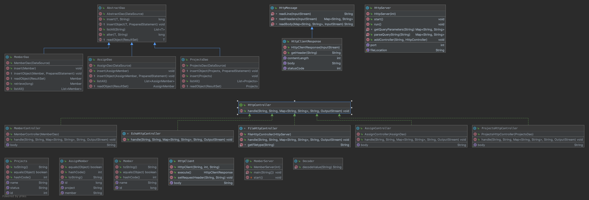

# PG203 Mappeinnlevering for gruppe <wiseflow gruppenummer>

## Hvordan kjøre dette programmet

### Bygg og test executable jar-fil

1. Hvilken kommando skal man kjøre?
2. Hvordan skal konfigurasjonsfilen opprettes?
3. Hvordan startet du programmet?

### Funksjonalitet

Programmet brukes for å holde oversikt mellom de forskjellige medlemene og deres arbeids oppgaver. 
Du kan legge til og se status på oppgaven, og legge til om den er under utvikling eller ferdig.

Programmet kjøres i index.html. Her er det linker til funkjsoner som å legge til oppgaver, medlemmer, velge medlemmer som
skal ha en gitt oppgave og sette status på dem.
Programmet kjører alt ut i nettleseren gjennom en database slik at du kan se hva som ligger i databasen. 

## Designbeskrivelse

Vi har designet oversikten slik at du enkelt kan legge til medlemmer du ønsker, gi dem en status 
og lett hoppe mellom de forskjellige oppgavene samt statusene. 
Vi har forsøkt så langt det lar seg gjøre å holde koden ren, ryddig og oversiktelig med god navngvning.

## Egenevaluering
Vi har sammarbeidet godt gjennom prosjektet og har beholdt sammarbeidspartner fra innlevering nr2.
Vi fyller hverandre godt ut og har aldri sitti med samme problem for lenge. 
Selvom det har vert utfordringer underveis har vi vert flinke til å feilsøke samt funnet god veiledning 
i felles elever og hverandre.

### Hva vi lærte underveis
Hvor viktig det er å gjennomføre tester samt hvor effektiv par-progrmering er. 
Hvordan fire øyne ser bedre enn to og hvor smidig det gikk i forrhold til å bare være en. 

### Hva vi fikk til bra i koden vår
Føler vi fikk god struktur på koden vår, spesielt da classene. De er oversiktlige og lette å lese.

### Hva vi skulle ønske vi hadde gjort annerledes
Vi skulle ønske vi fikk satt av mer tid til oppgaven. Desverre er det i år litt tett mellom eksamenene og da fikk vi ikke tid til alt vi skulle ønske.

## Evaluering fra annen gruppe
https://github.com/Westerdals/pgr203-2019-eksamen-Eskildt/issues

* Flere tester i MemberHttpControllerTest
* Bra med funksjonalitet
* Ryddig kodestruktur
* Hadde vært fint med hyperlink til localhost

## Evaluering gitt til annen gruppe
https://github.com/Westerdals/pgr203-2019-eksamen-Blixits/issues

* God mengde tester
* God kodestruktur og navngivning
* Tabellene inneholder flere kolonner enn nødvendig
* Mulig med mer oversiktlige classes
* Får ikke opp tasks
* Feil properties
